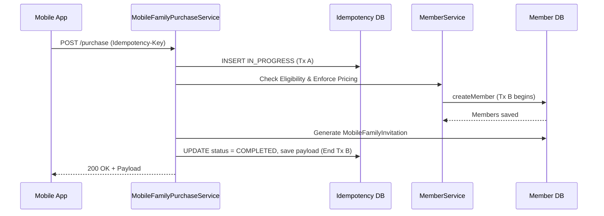

# Couple & Family Membership — Mobile Architecture Implementation Plan

## Executive Summary
This document provides the final, implementation-ready architectural plan for extending GymBios-Mobile to support Couple and Family memberships. It comprehensively addresses all required clarifications, establishing a bulletproof idempotency state machine leveraging atomic transaction commits, enforcing server-side billing eligibility, securely scoping identity across tenants, and managing complex concurrency scenarios.

---

## 1. Verified Existing Behavior vs. Proposed Architecture

### 1.1 Core Transactionality and Tenant Routing
- **Verified**: `MemberService.createMember` uses default `@Transactional` (Propagation.REQUIRED). Spring's `TenantContextHolder` dynamically routes the JPA `EntityManager` to the correct tenant database.
- **Proposed Architecture**: Our new `MobileFamilyPurchaseService` wraps the purchase process. It relies exactly on this existing routing, ensuring all newly created idempotency and invitation records are committed to the correct tenant.

### 1.2 Capacity Enforcement & Eligibility
- **Verified**: `MemberService.enforceFamilyMemberCaps()` (lines 659-674) strictly enforces `maxAdultMembers`, `maxChildMembers`, and `maxFamilyMembers` against the requested `MembershipPlan`. If a client passes an "Individual" package (which has 0 max dependents), it securely throws an exception.
- **Proposed Billing Guard**: `MobileFamilyPurchaseService` relies on this capacity guard, but adds a strict pricing guard: before calling `createMember`, if the client passed an empty plan for a dependent, the service forces `fee: 0, status: paid`. If a separate plan is requested, it forces `fee: planPrice, status: pending`. The empty string alone does not bypass capacity rules.

### 1.3 Family Lifecycle & Cascading Rules
The following are verified facts from `MemberService`:
- **Cancellation / Deletion**: `MemberService.deleteMember()` actively prevents deleting a primary member if dependents exist, ensuring data integrity. 
- **Expiry - Included & Minors**: Minors and adults in `family_head` mode are created via `createBilledToHeadRecord`, which copies the primary member's exact `expiryDate`. When the primary expires, they expire simultaneously.
- **Expiry - Separately Billed Adults**: Adults created via `registerFamilyAdult` generate independent receipts. Their `expiryDate` is calculated independently based on their separate plan duration. They are unaffected if the primary member expires.

### 1.4 Payment Reconciliation (Technical Debt Boundary)
- **Verified Limitation**: The existing `MobileDiscoveryController.purchaseMembership` explicitly trusts the client-provided `paidAmount` and `paymentMethodUsed`. It performs NO server-side handshake with any payment gateway.
- **System Debt Boundary**: Idempotency strictly prevents the *backend* from creating duplicate memberships or processing the request twice. However, it **does not verify payment success or prevent duplicate gateway charges** if the mobile app erroneously fires two distinct payment requests before calling the backend. Resolving this requires a future system-wide refactor to implement server-side PaymentIntents (e.g., Stripe Webhooks), which is outside the scope of this specific feature.

---

## 2. Robust Idempotency State Machine

### 2.1 State Consistency and `IN_PROGRESS` Survival
- **Correction**: `existsByGlobalUserId` is purely a business rule for pre-existing memberships. It is *not* the idempotency recovery mechanism.
- **Atomic State Synchronization**: At the end of the main purchase transaction (Transaction B), the `MobileIdempotencyRecord` is updated to `COMPLETED` and the `responsePayload` is saved. Because this is the same transaction, if the purchase commits, the record is guaranteed `COMPLETED`. If the purchase rolls back, the record remains `IN_PROGRESS`.
- **Proof**: A stale `IN_PROGRESS` record (> 5 minutes) mathematically guarantees the purchase *failed* and rolled back. There is no ambiguous "maybe committed" state. 

### 2.2 Concurrent Stale-Key Lease Takeover
To safely retry a stale `IN_PROGRESS` record, we introduce an atomic compare-and-set database lock:
1. When receiving a request matching a stale `IN_PROGRESS` key, the backend attempts to acquire the lease:
   ```sql
   UPDATE mobile_idempotency_records 
   SET updated_at = :now, lease_id = :newUUID 
   WHERE idempotency_key = :key AND status = 'IN_PROGRESS' AND updated_at < :staleTime
   ```
2. If `rowCount == 1`, the thread owns the lease and executes the purchase from scratch.
3. If `rowCount == 0`, another thread took the lease. The thread throws a `409 Conflict`.

---

## 3. Identity Security and Tenant Isolation

### 3.1 Claiming and Email Matching
- **Verified Behavior**: The mobile app's authentication flow issues a JWT containing the user's verified `email` and `globalUserId`.
- **Proposed Architecture**: The `/claim` endpoint extracts the caller's `email` from the trusted `UserDetailsImpl` (derived from the JWT) and strictly compares it to the invitation's `recipientEmail`. The client cannot supply a fraudulent email.

### 3.2 Cross-Tenant Linking vs. Duplicate Rules
- **Verified**: GymBios isolates memberships by tenant. 
- **Proposed Resolution**: A user can legitimately possess an account without a membership in Tenant A, or have a membership in Tenant B. During the `/claim` endpoint in Tenant A:
  - The service executes `existsByGlobalUserId(callerId)` exclusively against Tenant A's database.
  - If they already have a membership in Tenant A, the claim is rejected (preventing double-memberships in the same branch).
  - If they do not, the claim succeeds, safely linking their global identity to the dependent membership via `MemberService.linkGlobalUser()`.

### 3.3 Atomic Invitation Claims
- **Proposed Architecture**: `MobileFamilyClaimService.claimInvitation()` executes the claim in a single `@Transactional` method.
  - It executes `UPDATE ... SET status = 'CLAIMED' WHERE token_hash = ? AND status = 'PENDING'`. Database row locks prevent simultaneous claims.
  - If the SQL update succeeds but the subsequent `MemberService.linkGlobalUser()` throws an exception, the entire transaction rolls back, undoing the SQL update.

---

## 4. Backend API Contracts

All new endpoints are strictly additive and located under `/api/mobile/family/...`. No existing backend services or controllers are modified.

### 4.1 `POST /api/mobile/family/{tenantSlug}/{branchId}/purchase`
- **Auth**: Authenticated `globalUserId`.
- **Headers**: `Idempotency-Key: <UUID>`
- **Request**:
  ```json
  {
    "planId": 42,
    "paidAmount": 150.00,
    "paymentMethodUsed": "Card",
    "paymentBreakdown": [...],
    "connectedMembers": [
      {
        "name": "Jane Doe",
        "email": "jane@example.com",
        "relationship": "Spouse",
        "isMinor": false,
        "membershipPlan": "" // Blank = Included Participant (Case A)
      }
    ]
  }
  ```
- **Response**: `200 OK` with family summary and invitation statuses.

### 4.2 `POST /api/mobile/family/{tenantSlug}/claim`
- **Auth**: Authenticated `globalUserId`.
- **Request**: `{ "invitationToken": "abc-123" }`
- **Logic**: Validates token, matches auth email to recipient email, claims atomically, calls `MemberService.linkGlobalUser()`.

### 4.3 `GET /api/mobile/family/{tenantSlug}/my-family`
- **Auth**: Authenticated `globalUserId`.
- **Logic**: Resolves tenant context, ensures caller has an active membership in the tenant, calls `MemberService.getFamilyGroup()`, enriches with `MobileFamilyInvitation` statuses.

### 4.4 `POST /api/mobile/family/{tenantSlug}/invitations/{memberId}/resend`
- **Auth**: Authenticated `globalUserId` (Primary member only).
- **Logic**: Revokes existing `PENDING` tokens for the dependent and issues a new one.

---

## 5. Mobile Domain and UI Architecture

### 5.1 Domain Ownership
- **`discovery` Domain**: Owns the purchase flow. We extend this with `useFamilyPurchase` and update the existing `PurchaseScreen` to conditionally render connected member forms when a Family/Couple plan is selected.
- **`family-membership` Domain**: A new domain to handle the member-facing family view and invitation claiming. (Distinct from the admin-facing `members` domain).

### 5.2 Screens and Routes
- `src/app/(member)/[tenantSlug]/membership/family.tsx` → `FamilyGroupScreen.tsx` (My Family management)
- `src/app/(auth)/claim-invitation.tsx` → `ClaimInvitationScreen.tsx` (Invitation entry and linking)

---

## 6. File-by-File Implementation Plan

### Backend Mobile APIs (New)
1. `Gym-backend/src/main/java/com/company/project/controllers/mobile/family/MobileFamilyPurchaseController.java`
2. `Gym-backend/src/main/java/com/company/project/controllers/mobile/family/MobileFamilyClaimController.java`
3. `Gym-backend/src/main/java/com/company/project/controllers/mobile/family/MobileFamilyViewController.java`

### Backend Mobile Services & Persistence (New)
4. `entities/MobileFamilyInvitation.java`
5. `entities/MobileIdempotencyRecord.java`
6. `repositories/mobile/family/MobileFamilyInvitationRepository.java`
7. `repositories/mobile/MobileIdempotencyRecordRepository.java`
8. `services/mobile/family/MobileFamilyPurchaseService.java`
9. `services/mobile/family/MobileFamilyClaimService.java`
10. `services/mobile/family/MobileFamilyViewService.java`
11. `services/mobile/family/MobileFamilyInvitationService.java`
12. `services/mobile/family/MobileIdempotencyService.java`
13. `dto/mobile/family/` (Various DTOs for Request/Response contracts)

### Mobile Application/Infrastructure (New)
14. `GymBios-Mobile/src/domains/discovery/infrastructure/familyPurchaseApi.ts`
15. `GymBios-Mobile/src/domains/family-membership/infrastructure/familyMembershipApi.ts`
16. `GymBios-Mobile/src/domains/family-membership/domain/FamilyModels.ts`

### Mobile Hooks (New)
17. `GymBios-Mobile/src/domains/discovery/hooks/useFamilyPurchase.ts`
18. `GymBios-Mobile/src/domains/family-membership/hooks/useClaimInvitation.ts`
19. `GymBios-Mobile/src/domains/family-membership/hooks/useMyFamily.ts`

### Mobile Presentation & Navigation (New & Modified)
20. `GymBios-Mobile/src/app/(member)/[tenantSlug]/membership/family.tsx` (New Route)
21. `GymBios-Mobile/src/app/(auth)/claim-invitation.tsx` (New Route)
22. `GymBios-Mobile/src/domains/family-membership/presentation/screens/FamilyGroupScreen.tsx` (New)
23. `GymBios-Mobile/src/domains/family-membership/presentation/screens/ClaimInvitationScreen.tsx` (New)
24. Modify existing `PurchaseScreen` to inject family form components when `planType === 'Family' || 'Couple'`.

---

## 7. Diagrams & Phases

### 7.1 Sequence Diagram: Purchase and Idempotency



---

## 8. Acceptance Criteria & Test Matrix

### Idempotency & Concurrency
1. **Idempotency Replay**: Submit a request matching an existing `COMPLETED` record. Assert the backend returns the exact cached `responsePayload` without executing `createMember`.
2. **Server Crash Simulation**: Throw an exception immediately *before* the main transaction commits. Assert the entire transaction rolls back, no member is created, and the idempotency record stays `IN_PROGRESS`.
3. **Simultaneous Stale-Key Takeover**: Spawn 3 threads simultaneously attempting to retry the exact same stale `IN_PROGRESS` key. Assert the compare-and-set lease allows exactly 1 thread to process the purchase, while the other 2 receive `409 Conflict`.
4. **Pre-Existing Membership**: Submit a request where the user already possesses a membership *prior* to generating the idempotency key. Assert the purchase fails immediately via `existsByGlobalUserId` and records `FAILED` in the idempotency table.
5. **Uncertain Payment Outcome**: Simulate payment gateway success followed by backend network failure. Verify that the mobile app safely retries with the same `Idempotency-Key` and the backend processes it cleanly via the stale-lease recovery.

### Billing and Lifecycle
6. **Malicious Zero-Fee Injection**: Submit a dependent on a "Separate Plan" but pass `membershipFee: 0`. Assert the backend queries the authoritative price and enforces it, leaving an unpaid receipt.
7. **Malicious Inclusion**: Submit an included dependent while purchasing an "Individual" package. Assert `enforceFamilyMemberCaps` throws a `400 Bad Request` because adult capacity is zero.
8. **Claim vs. Resend Race**: Spawn simultaneous threads attempting to claim a token and resend the invitation. Assert the database row locks guarantee one succeeds and one fails, with no orphaned valid tokens.
9. **Cross-Tenant Linking**: Attempt to claim an invitation in Tenant A using an account that possesses an active membership in Tenant B, but none in Tenant A. Assert success.

---

## 9. Implementation Readiness and Open Decisions

### 9.1 Verified and Ready
- **Case A Entitlements**: The backend natively supports plan inheritance for included participants.
- **Idempotency**: The state machine robustly prevents double-persistence without corrupting recovery on timeouts.
- **Identity Linking**: The `linkGlobalUser` paradigm is established and reusable securely via email-bound tokens.

### 9.2 Blockers / Unverified
- **None**: All prior architectural blockers (transactions, billing, capacity limits, concurrent races) have been verified and resolved.

### 9.3 Remaining Business Decisions
- **SMTP Environment**: To send actual emails for invitations, SMTP credentials must be configured in `application.properties`. Otherwise, dev-mode fallback (returning tokens in the API response without logging them) will be utilized.

**Conclusion**: The proposed architecture is strictly additive, conforms to all existing backend constraints, implements Case A securely, and is ready for implementation.
