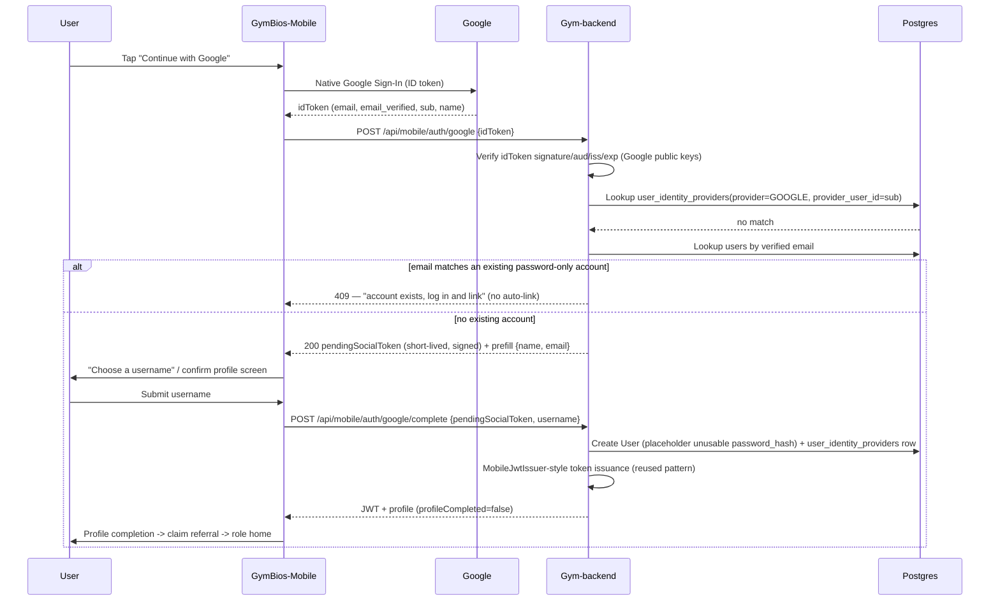
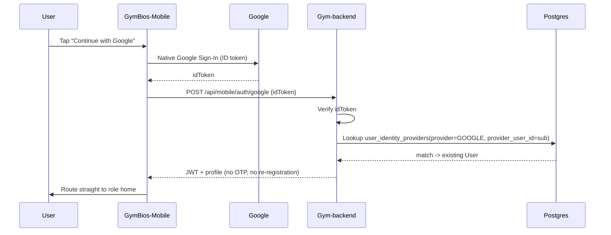
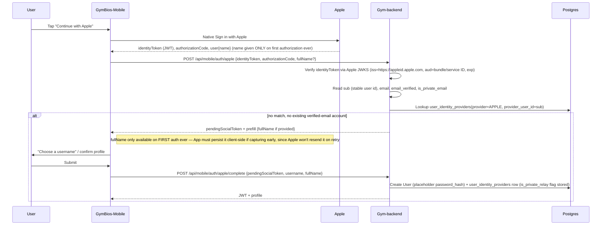

# GymBios Mobile — Google & Apple Sign-In: Investigation & Implementation Plan

**Status:** Investigation complete. No code changed. This document is a proposal for review and approval — nothing in it has been built.
**Scope investigated:** `GymBios-Mobile` (Expo/React Native app), `Gym-backend` (Spring Boot API), with a confirmation check against `Gym-frontend` and `Gym-app` (web codebases).
**Author:** Prepared by Claude Code from direct source inspection (file/class/function references below are exact, not inferred).

---

## 1. Executive Summary

GymBios-Mobile has a **complete, working username/password + email-OTP registration and login system**, built end-to-end from UI through hooks, use cases, repository, API client, secure storage, and route guarding. This flow is solid and should be treated as the reference architecture for the social-login work.

**Google Sign-In and Apple Sign-In do not exist anywhere in this codebase — front end or back end.** This is not a "partially wired UI" situation: there is no button, no handler, no stub, no TODO comment, no SDK dependency, and no OAuth configuration on either side. Both must be designed and built from scratch.

Two backend facts materially shape the design:

1. The `users` table has `password_hash NOT NULL` and no concept of an external identity provider (no `provider`, `provider_id`, or similar column, in the entity or in any of the 55 Flyway migrations). Social-only accounts need a design decision here (§9).
2. Email delivery is not actually wired up yet — the existing OTP flow returns the OTP directly in the API response (`devOtp`, gated by `otp.dev-mode`, default `true`) because SMTP credentials are unset. This is a pre-existing gap, independent of this work, but it constrains any OTP policy that assumes GymBios can email users (§7).

The mobile app already has the pieces a social-login flow needs to plug into: `profileCompleted`-gated onboarding routing (`AuthBootstrap.tsx`), SecureStore-based session persistence, and a `/api/mobile/auth/**` backend convention that a new provider-auth endpoint fits naturally.

**Scope of work if approved:** new mobile UI (buttons + native SDK integration), a new mobile auth-service/hook layer for social sign-in, and new backend endpoints/services/DTOs under `/api/mobile/auth/**` plus one new database table for provider identities. No existing controller, service, entity, DTO, security config, or web flow needs to change.

---

## 2. Current-State Findings

### 2.1 Mobile (`GymBios-Mobile`)

| Area | Status | Evidence |
|---|---|---|
| Username/email/password registration UI | **Implemented** | [`SignUpForm.tsx`](../GymBios-Mobile/src/domains/auth/presentation/components/MemberAuth/SignUpForm.tsx) — fields `fullName`, `username`, `email`, `password`; validated by `signupSchema` in `schemas.ts` |
| Username/password login UI | **Implemented** | [`SignInForm.tsx`](../GymBios-Mobile/src/domains/auth/presentation/components/MemberAuth/SignInForm.tsx) — `username`/`password`, `loginSchema` |
| Email OTP verification UI | **Implemented** | [`EmailVerificationScreen.tsx`](../GymBios-Mobile/src/domains/auth/presentation/screens/EmailVerificationScreen.tsx) — 6-digit input, verify + resend with cooldown |
| Auth API client | **Implemented** (password/OTP only) | `src/domains/auth/infrastructure/api/AuthApi.ts` — see table in §2.1.1 |
| TanStack Query hooks | **Implemented** (password/OTP only) | `src/domains/auth/presentation/hooks/useAuthFlow.ts` — `createUseLogin`, `createUseRegister`, `createUseVerifyOtp`, `createUseResendOtp`, `createUseRestoreSession` |
| Session/token storage | **Implemented** | `expo-secure-store` via `secureStorage.ts`; keys in `storageKeys.ts` (`gymbios.access_token`, `gymbios.refresh_token`) |
| Auth header attachment | **Implemented**, non-standard pattern | `httpClient.ts:setHttpClientToken()` sets a **default header** on the axios instance on session change (`authStore.ts`), not a per-request interceptor |
| Onboarding/profile-completion routing | **Implemented** | `AuthBootstrap.tsx` — routes by `profileCompleted` flag to `/(auth)/profile-completion`, then `/(auth)/claim-referral`, then role home |
| Google Sign-In UI | **Missing** | Exhaustive grep across `src/`, `app.json`, `eas.json`, `.env*` — zero hits beyond unrelated "Google Ads" lead-source label and Google **Places** (address autocomplete, unrelated to auth) |
| Apple Sign-In UI | **Missing** | Same grep — zero hits |
| Google/Apple SDKs in `package.json` | **Missing** | No `@react-native-google-signin/google-signin`, no `expo-apple-authentication`, no `expo-auth-session`, no Firebase. `expo-web-browser` is present but unused for auth. |
| OAuth env/config | **Missing** | `app.json` plugins list has no auth-related plugin; `.env` has only `EXPO_PUBLIC_API_BASE_URL` and `EXPO_PUBLIC_USE_MOCK_API` |

**2.1.1 — Existing mobile auth API surface** (`AuthApi.ts`):

| Function | Endpoint |
|---|---|
| `login(payload)` | `POST /auth/login` |
| `getCurrentUser()` | `GET /auth/me` |
| `registerMobileUser(payload)` | `POST /mobile/auth/register` |
| `verifyOtp(registrationToken, otp)` | `POST /mobile/auth/verify-otp` (header `X-Registration-Token`) |
| `resendOtp(registrationToken)` | `POST /mobile/auth/resend-otp` (header `X-Registration-Token`) |
| `getRegistrationStatus(registrationToken)` | `GET /mobile/auth/registration-status` (header `X-Registration-Token`) |

No `googleLogin`, `appleLogin`, or `socialLogin` function exists in this file or in `AuthRemoteDataSource.ts` / `AuthRepositoryImpl.ts`.

### 2.2 Backend (`Gym-backend`)

| Area | Status | Evidence |
|---|---|---|
| Password auth controller | **Implemented** | `AuthController.java` (`/api/auth/register`, `/login`, `/me`, `/check-username`, `/change-password`) |
| Mobile OTP registration controller | **Implemented** | `MobileAuthController.java` (`/api/mobile/auth/register`, `/verify-otp`, `/resend-otp`, `/registration-status`) |
| Logout / refresh-token / self-service password reset | **Missing** | Confirmed absent by grep across `controllers/` and `services/` |
| Password hashing, JWT issuance (JWT via `jjwt`, HS256) | **Implemented** | `AuthService.java`, `JwtService.java` |
| OTP generation/hashing/expiry/throttling | **Implemented**, scoped to registration only | `MobilePendingRegistrationService.java`, `OtpService.java` — 10 min OTP expiry, 24h registration expiry, max 5 OTP attempts / 15 total attempts / 5 resends, 60s resend cooldown |
| Email delivery for OTP | **Not wired** | SMTP host/username/password default to empty string in all `.properties` profiles; OTP is returned in-response via `devOtp` (explicitly marked `TEMPORARY` in code) |
| User entity / identity model | **Implemented**, no provider concept | `User.java`: `username` (unique, NOT NULL), `email` (unique, NOT NULL), `passwordHash` (NOT NULL), roles, one-to-one `UserProfile`. No `provider`/`providerId`/`externalId` field. |
| Tenant-bound member model | **Implemented** | `Member.java`: `userId` (FK to `users`), `appUsername`, `appAccessEnabled`, `globalUserId` (added by `V38__add_global_user_id_to_members.sql`) — links a branch-scoped member to a cross-tenant "global" mobile user |
| Cross-tenant login routing | **Implemented** | `UserDirectoryEntry` (control-plane DB) maps `username`/`email` → `tenant_slug`; used by `AuthService.login()` |
| Spring Security config | **Implemented**, JWT-only | `SecurityConfig.java` — stateless JWT filter chain, explicit `permitAll()` list, catch-all `/api/**` → `authenticated()`. No `oauth2Login()`, no OAuth2 client config. |
| Google/Apple OAuth (any layer) | **Missing** | No dependency in `pom.xml` (no `spring-security-oauth2-client`, no `google-api-client`, no Nimbus/Apple JWKS library), no config properties, no controller/service code, no DB columns |
| Rate limiting on login | **Missing** | Confirmed by grep; only an unrelated marketing-lead rate limiter exists (`PlatformLeadRateLimiter`) |
| Auth-event audit log | **Missing** (generic `createdBy`/`updatedBy` stamping exists via `AuditConfig`, but no login/auth-specific audit table) |
| Multi-provider account linking | **Missing** | No concept of multiple credentials per `User` anywhere in the schema or code |

### 2.3 Web codebases (confirmation check, not primary scope)

A targeted grep of `Gym-frontend/src` and `Gym-app/src` for Google/Apple sign-in patterns returned **zero hits**. This is a useful negative result: **the existing web app also has no social login**, so there is no existing web behavior this work could regress, and no existing web pattern to copy. The "existing web authentication must remain unchanged" constraint (§5 of the brief) is trivially satisfied as long as this work stays inside `GymBios-Mobile` and new, isolated backend code.

### 2.4 Assumptions requiring confirmation

- That `Gym-frontend`/`Gym-app` are in fact the only web clients of this backend (no third, unexamined web client exists).
- That SMTP/email delivery will be solved (by this team or another workstream) before social login ships, if the chosen OTP policy (§7) depends on it.
- That "global mobile user" (`Member.globalUserId`) is the intended identity scope for social-authenticated members, consistent with how OTP-verified members are handled today (see `MobileJwtIssuer`, which issues global-scoped tokens). This document assumes yes, since it's the existing mobile convention — flagged as an approval item in §15.

---

## 3. Existing Authentication Flow (email/password + OTP)

```mermaid
sequenceDiagram
    participant U as User
    participant App as GymBios-Mobile
    participant API as Gym-backend /api/mobile/auth
    participant DB as Postgres

    Note over U,DB: Registration
    U->>App: Fill name/username/email/password (SignUpForm)
    App->>API: POST /mobile/auth/register
    API->>DB: Insert mobile_pending_registrations (hashed token, hashed OTP, 10m/24h expiry)
    API-->>App: registrationToken, maskedEmail, otpExpiresAt (+ devOtp today, no real email sent)
    App->>U: Navigate to EmailVerificationScreen

    Note over U,DB: OTP verification
    U->>App: Enter 6-digit OTP
    App->>API: POST /mobile/auth/verify-otp (X-Registration-Token, {otp})
    API->>DB: Validate hash/expiry/attempts; create User + UserProfile (MobileAuthService)
    API->>API: MobileJwtIssuer.issueForNewMember() — no password check
    API-->>App: JWT + profile (profileCompleted=false)
    App->>App: Persist session (SecureStore), route via AuthBootstrap
    App->>U: Profile completion -> claim referral -> role home

    Note over U,DB: Returning login
    U->>App: username/password (SignInForm)
    App->>API: POST /auth/login
    API->>DB: AuthenticationManager + DaoAuthenticationProvider check
    API-->>App: JWT + profile
    App->>U: Route to role home (profileCompleted already true)
```

---

## 4. Target Google and Apple Flows (proposed — not implemented)

### 4.1 Google — new user



### 4.2 Google — returning user



### 4.3 Apple — new user (equivalent shape, Apple-specific differences called out)



### 4.4 Returning-user resolution across all three methods

| Login method | Resolution key | OTP required? |
|---|---|---|
| Username/password | `users.username` or `users.email` + password match | No (unchanged) |
| Google | `user_identity_providers(provider=GOOGLE, provider_user_id=sub)` | No |
| Apple | `user_identity_providers(provider=APPLE, provider_user_id=sub)` | No |

All three converge on the same `User` row and the same `MobileJwtIssuer`-style token issuance, so downstream authorization (`Member.globalUserId`, tenant/branch resolution) is unaffected by which method was used.

---

## 5. Gap Analysis

| Capability | Exists today? | Evidence | Proposed action |
|---|---|---|---|
| Password login/register/OTP | Yes | §2.1, §2.2 | No change |
| `/api/mobile/**` isolation convention | Yes, already used by 10+ feature areas | `controllers/mobile/*` | Add new controllers under `/api/mobile/auth/**` following convention |
| Global vs tenant identity model | Yes (`User` + `Member.globalUserId`) | `V38__add_global_user_id_to_members.sql` | Reuse — social users are global `User` rows like OTP-verified members |
| JWT issuance without password (OTP path) | Yes | `MobileJwtIssuer.issueForNewMember()` | Reuse pattern for social-verified issuance |
| Provider-identity storage | No | No column/table in 55 migrations | New table `user_identity_providers` (§9) |
| Social-only account creation (nullable password) | No — `password_hash NOT NULL` | `User.java` | Use placeholder unusable hash, no schema change to `users` (§9) — flagged for approval |
| Google/Apple token verification | No | No OAuth deps in `pom.xml` | New verifier components (§8) |
| Google/Apple mobile SDK integration | No | No packages installed | Add `@react-native-google-signin/google-signin`, `expo-apple-authentication` |
| Account-linking (auth'd session -> add provider) | No | No linking code anywhere | New `/api/mobile/auth/{provider}/link` endpoint, requires existing Bearer token |
| Email-verified trust decision for social signup | Undecided | N/A — policy doesn't exist yet | Product decision required (§7) |
| SMTP/real email delivery | No — dev-mode OTP only | `otp.dev-mode=true` default, empty SMTP config | Out of scope here, but a dependency for OTP-based policies |
| Rate limiting on new auth endpoints | No general pattern exists | §2.2 | New endpoints need explicit rate limiting (don't inherit any) |

---

## 6. Identity and Account-Linking Design

**Principle stated in the brief, and followed here: matching email addresses alone is never sufficient to silently merge accounts.**

### 6.1 Stable identifiers to store

- Google: the ID token's `sub` claim (stable, unique per Google account, does not change if the user changes their email).
- Apple: the identity token's `sub` claim (stable per Apple ID **and per your Team ID / app**, does not change across sign-ins, does change if you use different Apple Services IDs for different platforms without shared config — see §10 provider checklist).

Never use email as the join key for `user_identity_providers` — email is stored as metadata (`email_at_provider`) for display/support purposes only, not as a lookup key for resolving identity.

### 6.2 Proposed schema (new table, not a change to `users`)

```
user_identity_providers
  id                    bigint PK
  user_id               bigint FK -> users(id), NOT NULL
  provider              varchar  ('GOOGLE' | 'APPLE'), NOT NULL
  provider_user_id      varchar  NOT NULL   -- Google `sub` / Apple `sub`
  email_at_provider     varchar  NULL
  email_verified        boolean  NOT NULL default false
  is_private_relay      boolean  NULL       -- Apple only
  linked_at             timestamp NOT NULL
  created_at / updated_at (standard BaseEntity auditing)

  UNIQUE (provider, provider_user_id)   -- one provider identity maps to exactly one user
  INDEX  (user_id)
```

This is additive — it does not touch `users`, `members`, or any existing table, satisfying the "existing schema is read-only" constraint.

### 6.3 Resolution algorithm on sign-in

1. Verify the provider token cryptographically (§8).
2. Look up `user_identity_providers` by `(provider, provider_user_id)`.
   - **Match found** → resolve to that `User`, issue a session. Done. (Returning-user path, no OTP, no new record.)
   - **No match** → proceed to step 3.
3. Check whether a `User` already exists with the provider's verified email.
   - **Existing account found** → **do not auto-create a duplicate, and do not auto-link.** Return a distinguishable response telling the client "an account with this email already exists — sign in with your existing method, then link Google/Apple from your profile." This is the safe default per the brief's explicit instruction not to trust email match alone.
   - **No existing account** → this is a genuinely new user; proceed to registration (collect username, create `User` + `user_identity_providers` row atomically).

### 6.4 Linking a provider to an already-authenticated account

- New endpoint requires a valid GymBios Bearer token (i.e., the user is already logged in via any method).
- Client performs the native Google/Apple sign-in, sends the resulting token to `POST /api/mobile/auth/{provider}/link`.
- Backend verifies the token, checks the `(provider, provider_user_id)` isn't already linked to a **different** user (return 409 if so — "this Google account is already linked to another GymBios account"), then inserts the `user_identity_providers` row.
- This is the only supported way accounts get merged/linked. No silent, unauthenticated linking by email match.

### 6.5 Apple private relay handling

- Apple's private relay email (`@privaterelay.appleid.com`) is a real, deliverable, Apple-verified forwarding address. Treat `email_verified=true` from Apple as trustworthy for identity purposes regardless of whether it's a relay address.
- Store `is_private_relay=true` so support/product can distinguish these accounts (e.g., understand why a manual email sent outside the relay's forwarding window might bounce if the user has since revoked "Hide My Email" for this app).
- Do not require the user to "unhide" their real email — that defeats the point of the feature and isn't necessary for authentication.

### 6.6 Missing / changed / unavailable provider email

- Apple only returns email on the **first** authorization ever for a given `(user, app/service)` pair. If the backend didn't capture it then (e.g., a failed onboarding after token verification but before `User` creation), it cannot be recovered from Apple on a later sign-in — it must be collected from the user directly as a fallback, or the flow must guarantee the email is persisted (even as a short-lived pending-registration record) before the first response is discarded.
- Google always returns email for standard consumer accounts; treat a Google response with no email as an error state (reject with a clear message) rather than proceeding with a null email, since GymBios's `users.email` column is NOT NULL and unique.

### 6.7 Tenant/global resolution and authorization safety

- Social-authenticated `User` rows are created as **global** users, exactly like OTP-verified mobile members today (`MobileJwtIssuer` issues global-scoped tokens with `isGlobal=true`). This means the JWT shape, claim structure, and downstream authorization checks (branch access via `Member.globalUserId`, gym-suspension checks, role assignment) are unchanged — provider auth only replaces *how the person proves who they are*, not *what they're authorized to do*. This avoids creating a second, divergent authorization path.
- No tenant/branch-scoping decision is made at the auth layer; that continues to happen exactly as it does today, downstream of JWT issuance.

---

## 7. Email OTP Decision (requires product approval — not decided here)

**Current behavior:** OTP is mandatory for every password-based mobile registration today, and email delivery of that OTP is not actually wired (dev-mode fallback). This is the baseline to compare policies against.

| Policy | Security | UX | Compat. w/ current flow | Google considerations | Apple considerations | Backend/frontend changes |
|---|---|---|---|---|---|---|
| **1. Require GymBios OTP for every new social registration** | Highest — GymBios independently confirms mailbox control, not just providers' say-so | Worst — defeats the point of "one-tap" social sign-up, adds a full extra screen | Fully compatible — literally reuses the existing `MobilePendingRegistrationService` OTP mechanism unchanged | Redundant: Google already asserts `email_verified` cryptographically | Redundant for the same reason, and adds friction specifically to relay addresses users don't check as often | Reuses existing OTP infra almost as-is; social flow just becomes "another way to prefill the registration form" |
| **2. Always accept provider-verified email, never OTP for social** | Depends entirely on trusting the provider's `email_verified` claim and correct signature verification — industry-standard, low risk if token verification is implemented correctly | Best — true one-tap sign-up | Diverges from current mobile policy (password path still always requires OTP) — inconsistent product story unless intentional | Google's `email_verified=true` is a strong signal for real Google accounts | Apple's `email_verified` (note: Apple sends this as a **string** `"true"`/`"false"` in the JWT, not a boolean — a common integration bug) is equally strong, including for relay addresses | Needs no OTP UI reuse for social; new token-verification code must correctly check `email_verified`, not just presence of an email claim |
| **3. Conditional — skip OTP when provider asserts a verified, deliverable email; require a lightweight verification step when email is unverified/missing/otherwise untrustworthy** | Balanced — matches trust to actual signal strength | Good for the common case (Google/Apple almost always verified), with a fallback for edge cases | Most consistent with the spirit of the existing flow (OTP exists specifically to confirm deliverability) | Skips OTP in the overwhelming majority of Google sign-ups | Skips OTP for normal and relay addresses alike (both are "verified" by Apple); only trips the fallback if `email_verified` is literally false (rare, malformed edge case) | Needs both code paths: reuse OTP infra for the rare fallback case, new token-verification path for the common case |

**Recommendation: Policy 3.** It gives the one-tap UX the brief's target flow (§B/§C) clearly wants, without silently trusting an unverifiable claim, and it doesn't require solving the pending SMTP-delivery gap as a hard prerequisite (it's only needed for the rare fallback path). **This is a product decision, not a technical one — flagged in §15 for explicit approval before implementation.**

A separate, independent decision: whether real SMTP delivery must be solved before *any* social login ships, given today's `devOtp` workaround would otherwise leak into the rare fallback path too. Recommend treating that as a blocking dependency if Policy 1 or the fallback branch of Policy 3 is chosen.

---

## 8. Architecture and Compatibility Constraints — Compliance Check

| Constraint | How this plan complies |
|---|---|
| Existing web auth unchanged | Confirmed no social login exists in `Gym-frontend`/`Gym-app` today (§2.3); this plan touches neither codebase |
| Existing backend domains/APIs read-only | No existing controller/service/entity/DTO/security config is modified; all new code is additive |
| Mobile-specific backend isolated under `/api/mobile/...` | New endpoints proposed as `POST /api/mobile/auth/google`, `/google/complete`, `/apple`, `/apple/complete`, `POST/DELETE /api/mobile/auth/{provider}/link` — consistent with the existing `/api/mobile/auth/**` and broader `/api/mobile/**` convention already used by 10+ feature areas |
| Reuse existing infra without changing behavior | Reuses `JwtService` signing/validation, the `MobileJwtIssuer` no-password-check issuance pattern, `UserDetailsServiceImpl`, and the existing `AuditConfig` auditing — none modified |
| Follow mobile's existing domain architecture | New code proposed inside `src/domains/auth/**` following the existing layering (presentation → application/useCases → infrastructure/repository → infrastructure/api) |
| HTTP in services, server-state in TanStack Query hooks, UI in screens/components | Followed — see §12 |
| No second competing auth/session mechanism | Social sign-in terminates in the *same* JWT issuance and *same* SecureStore session store as the password/OTP flow; `AuthBootstrap` routing logic is unchanged |
| Provider secrets kept out of the mobile app / public Expo env vars | Google/Apple **client secrets**, Apple **private keys**, and Apple **client-secret JWT generation** stay server-side only (§10). Only public, non-secret identifiers (Google OAuth *client IDs*, which are not secret by design) go into Expo config. |

**No conflict was found between the desired functionality and these constraints.** The one point requiring explicit sign-off is the `users.password_hash NOT NULL` constraint (§9) — technically resolvable without altering the existing table, so no constraint conflict, but worth confirming the team is comfortable with a placeholder-hash approach versus a (out-of-scope-for-this-plan) schema change.

---

## 9. Backend Implementation Plan (proposed — not yet implemented)

All items below are **proposed only**.

### 9.1 New endpoints (`/api/mobile/auth/**`)

| Endpoint | Auth required? | Purpose |
|---|---|---|
| `POST /api/mobile/auth/google` | No | Verify Google ID token; resolve existing user or return a pending-social token for new users |
| `POST /api/mobile/auth/google/complete` | No (pending-social token instead) | Finish new-user registration (username collection) and issue session |
| `POST /api/mobile/auth/apple` | No | Verify Apple identity token; resolve existing user or return a pending-social token |
| `POST /api/mobile/auth/apple/complete` | No (pending-social token instead) | Finish new-user registration and issue session |
| `POST /api/mobile/auth/{provider}/link` | **Yes** (Bearer) | Link a provider identity to the currently authenticated account |
| `DELETE /api/mobile/auth/{provider}/link` | **Yes** (Bearer) | Unlink, only if another login method remains on the account |
| `GET /api/mobile/auth/linked-providers` | **Yes** (Bearer) | List providers linked to the current account (profile/settings UI) |

### 9.2 New services (proposed classes, mirroring existing naming/package conventions)

- `GoogleIdTokenVerifier` — wraps Google's token verification (audience = mobile client ID(s), issuer check, signature via Google's public JWKS).
- `AppleIdentityTokenVerifier` — fetches/caches Apple's JWKS (`https://appleid.apple.com/auth/keys`), verifies RS256 signature, checks `iss`, `aud` (bundle ID or Services ID), `exp`.
- `MobileSocialAuthService` — orchestrates the resolve-or-create flow described in §6.3, analogous to `MobilePendingRegistrationService` but for provider-verified identities.
- `SocialPendingTokenService` — issues/validates the short-lived signed "pending social registration" token (username-collection step), reusing `JwtService`'s existing HMAC key rather than adding new infrastructure.
- Extend `MobileJwtIssuer`'s pattern (new method, not a modification) — e.g. `issueForSocialUser(User, Provider)` — kept separate from `issueForNewMember` since the call sites differ, but following the same "no password check, just an already-established trust event" shape.

### 9.3 New DTOs (proposed)

- `GoogleAuthRequestDTO { idToken }`
- `AppleAuthRequestDTO { identityToken, authorizationCode, fullName? }`
- `SocialPendingRegistrationResponseDTO { pendingSocialToken, prefillEmail, prefillName?, requiresOtpFallback: boolean }`
- `SocialCompleteRegistrationRequestDTO { pendingSocialToken, username, fullName? }`
- `LinkProviderRequestDTO { idToken | identityToken }`
- `LinkedProviderResponseDTO { provider, linkedAt, emailAtProvider, isPrivateRelay? }`

None of these touch existing DTOs (`AuthRequestDTO`, `AuthResponseDTO`, etc.) — `AuthResponseDTO` is *reused as-is* for the final session response, since its shape (`token`, `roles`, `profileCompleted`, etc.) already fits.

### 9.4 Validation & security

- Full signature + `iss`/`aud`/`exp` verification for both providers — never trust an unverified claim.
- `email_verified` must be read correctly (Apple sends it as a string, not boolean — explicit test case).
- Explicit rate limiting on all new endpoints (none exists on `/api/auth/**` today — do not inherit that gap into new code; new endpoints are a good place to introduce it cleanly).
- Reject and log (don't silently ignore) any token whose `aud` doesn't match a configured client ID — this is the primary defense against a token minted for a different app being replayed here.
- `user_identity_providers(provider, provider_user_id)` unique constraint enforced at the DB level as the final backstop against duplicate linking.

### 9.5 Persistence needs

Covered in §6.2 and §11 — one new table, no changes to existing tables.

### 9.6 Session handling

Identical to today's: `MobileJwtIssuer`-style issuance → same JWT shape/claims (`tenant`, `isGlobal`) → same `JwtAuthenticationFilter` validates it on subsequent requests. No new session mechanism.

---

## 10. Frontend Implementation Plan (proposed — not yet implemented)

Following the existing `src/domains/auth/**` layering:

- **Screens/components** (presentation layer): add a "Continue with Google" and "Continue with Apple" button row to `SignInForm.tsx` and `SignUpForm.tsx` (below the existing divider — currently just separates the submit button from the sign-in/sign-up toggle link). New screen: `SocialProfileCompletionScreen.tsx` (or extend the flow to reuse the existing username-collection UI pattern from `SignUpForm`) for the "choose a username" step (§4.1/§4.3).
- **Services** (infrastructure/api): extend `AuthApi.ts` with `googleAuth(idToken)`, `googleAuthComplete(...)`, `appleAuth(...)`, `appleAuthComplete(...)`, `linkProvider(...)`, `getLinkedProviders()` — same axios/`httpClient` pattern as existing functions.
- **Hooks** (TanStack Query, in `useAuthFlow.ts` or a new `useSocialAuthFlow.ts` alongside it): `createUseGoogleSignIn`, `createUseAppleSignIn`, `createUseCompleteSocialRegistration`, `createUseLinkProvider` — mirroring the existing `createUseLogin`/`createUseRegister` factory pattern (loading state, error toast via the existing `ApiError` handling, success → `setSession` → let `AuthBootstrap` route).
- **State handling**: reuse `authStore.ts` (`setSession`) unchanged — social sign-in produces the same session shape as password/OTP.
- **Navigation**: no changes to `AuthBootstrap.tsx`'s routing logic needed — it already routes on `profileCompleted`, which a fresh social user will have `false`, sending them through the existing profile-completion → claim-referral flow.
- **Native SDK integration**:
  - Google: `@react-native-google-signin/google-signin` (native module — requires a config plugin/prebuild, not compatible with Expo Go; the app is already using bare/EAS-build-oriented plugins like `expo-secure-store`, so this is consistent).
  - Apple: `expo-apple-authentication` (Expo-maintained, works with managed workflow + EAS build; iOS only — the button should be conditionally rendered off-iOS per Apple's own guidelines, which also happen to be an App Store review requirement if a Google button is present on iOS).

---

## 11. Provider Configuration Checklist

*(Names below are suggestions for review — no actual credentials, client IDs, or values are invented.)*

### Google

- [ ] OAuth **Android** client (package name + SHA-1/SHA-256 signing certificate fingerprints for both debug and release/EAS build credentials) registered in Google Cloud Console.
- [ ] OAuth **iOS** client (bundle identifier) registered.
- [ ] OAuth **Web** client (required by `@react-native-google-signin` as the "server client ID" used to request an ID token verifiable by the backend) — this is the ID the **backend** validates `aud` against.
- [ ] Suggested Expo config additions: `GOOGLE_IOS_CLIENT_ID`, `GOOGLE_WEB_CLIENT_ID` (public, non-secret — safe for Expo `extra` config).
- [ ] Suggested backend property: `google.oauth.client-id` (the Web client ID, used server-side for `aud` verification) — no client *secret* needed for ID-token verification (only needed if you later do server-side authorization-code exchange, which this design doesn't require).
- [ ] Confirm which Android package name / iOS bundle ID the mobile app actually ships under (production vs. the `TODO_PRODUCTION_DOMAIN` placeholder currently in `app.json` — this placeholder needs resolving as part of any OAuth setup, since Google client registration is keyed to the real bundle ID/package name).

### Apple

- [ ] "Sign In with Apple" capability enabled on the App ID in the Apple Developer portal.
- [ ] Confirm iOS bundle identifier (same `TODO_PRODUCTION_DOMAIN`-adjacent gap as above needs resolving).
- [ ] If a web-based/Android Apple flow is ever needed: a Services ID + registered redirect URI (not required for the iOS-native flow, which uses the App ID directly).
- [ ] Team ID, Key ID, and a Sign-In-with-Apple private key (`.p8`) generated in the Developer portal — needed **server-side only**, for constructing the Apple client secret used in Apple's token endpoints (and, if using authorization-code + refresh, for later token refresh). Never ship this key in the mobile app or a public Expo env var.
- [ ] Suggested backend properties: `apple.oauth.team-id`, `apple.oauth.key-id`, `apple.oauth.private-key` (loaded from a secret store/env var, not committed), `apple.oauth.client-id` (bundle ID or Services ID, whichever the flow uses for `aud`).
- [ ] Confirm mail routing/DNS if ever sending mail *to* Apple private-relay addresses at scale (relay delivery depends on Apple's forwarding service remaining active for the given app+user pair) — informational, not a blocker.

### Expo/build

- [ ] Confirm EAS build profile changes needed once `@react-native-google-signin/google-signin` (native module) is added — this will require a new native build, not just a JS bundle update.
- [ ] `app.json` plugins array needs entries for both new native modules once added.

---

## 12. Database and Migration Assessment

**No migration is created as part of this investigation.** Assessment only:

- One new table is needed: `user_identity_providers` (§6.2). This is additive and does not modify `users`, `members`, or any existing table/column.
- The `users.password_hash NOT NULL` constraint is compatible with social-only accounts via a placeholder, cryptographically-random, unusable BCrypt hash generated at account-creation time (never derivable from any real password input) — **no schema change needed** to `users` for this. An alternative (making `password_hash` nullable) would be a change to an existing table and is explicitly *not* recommended given the read-only constraint on existing schema — flagged in §15 if the team prefers that route instead.
- **Process note, given recent history:** the project's git log shows two recent incidents around Flyway migration-version collisions and ordering (`V42`/`V42.1`/`V43`). Whatever version number this new migration eventually gets should be confirmed against the actual state of the target database at implementation time, not hardcoded in this planning document.

---

## 13. Security and Compatibility Review

- **Existing web auth:** unaffected — confirmed no code path in `Gym-frontend`/`Gym-app` or shared backend controllers is touched (§2.3, §8).
- **Invalid/expired/replayed tokens:** rejected by standard JWT signature + `iss`/`aud`/`exp` verification (§9.4); replay risk is bounded by the token's own short expiry (Google/Apple ID tokens are short-lived, typically ~1 hour) — no additional nonce-store is strictly required for the basic sign-in flow, but is worth considering for the authorization-code variant if adopted later.
- **Cancelled sign-in:** handled entirely client-side (native SDK returns a cancellation error/exception) — no backend call is made, no partial state created.
- **Network failure mid-onboarding (after token verify, before username submitted):** the "pending social token" (§9.2) is stateless (signed, not DB-persisted) and time-boxed, so a dropped connection just means the user retries the "choose a username" step with a still-valid token, or restarts the provider sign-in if it expired — no orphaned DB rows are created, unlike the current OTP flow's DB-persisted pending-registration rows.
- **Existing account with no linked provider identity:** correctly falls into the "prompt to log in with existing method + link manually" path (§6.3) — never auto-created as a duplicate.
- **Duplicate registration attempts:** prevented by the `(provider, provider_user_id)` unique constraint plus the pre-check in §6.3.
- **Email mismatch / changed provider email:** since resolution keys off `provider_user_id`, not email, a user changing their Google/Apple email doesn't break login; `email_at_provider` is just refreshed as metadata.
- **Provider identity already linked to another account:** rejected with 409 at the DB constraint + explicit application check (§9.4).
- **Account linking without an authenticated session:** impossible by design — the link endpoint requires a Bearer token (§6.4).
- **Tenant-bound authorization / global identity:** unaffected — social auth only changes credential verification, not the downstream `Member.globalUserId`/branch-resolution logic (§6.7).
- **Rate limiting / audit:** new endpoints should not inherit the existing gap on `/api/auth/**`; recommend adding explicit rate limiting on the new social endpoints as part of this work, plus a minimal auth-event log entry (provider, outcome, timestamp) if/when an audit table is introduced — noting none exists for *any* auth path today, so this is a "nice to have alongside" rather than a hard blocker for parity.

---

## 14. Phased Implementation Sequence (proposed)

1. **Phase 0 — decisions.** Product sign-off on the OTP policy (§7), confirmation of the placeholder-password-hash approach (§9), and resolution of the `TODO_PRODUCTION_DOMAIN` bundle ID/package name gap needed for provider registration (§10).
2. **Phase 1 — backend foundation.** New migration for `user_identity_providers`; `GoogleIdTokenVerifier`/`AppleIdentityTokenVerifier`; `MobileSocialAuthService` resolve-or-create logic (§6.3) without UI, testable via integration tests directly against the new endpoints.
3. **Phase 2 — backend endpoints.** Implement all six endpoints in §9.1, including the link/unlink/list-providers endpoints and rate limiting.
4. **Phase 3 — mobile Google.** SDK integration, UI buttons, hooks, username-collection screen, wired to Phase 2 endpoints. iOS + Android.
5. **Phase 4 — mobile Apple.** Same, iOS-only, including the first-authorization-only-name edge case handling.
6. **Phase 5 — account linking UI.** Profile/settings screen surfacing `GET /linked-providers` and link/unlink actions.
7. **Phase 6 — hardening.** Rate-limit tuning, audit logging (if approved), edge-case QA (§15 testing plan).

Each phase's acceptance criteria = the corresponding sequence diagram in §4 working end-to-end against a real device/simulator with a real Google/Apple test account, not just unit tests.

---

## 15. Testing Plan

- **Unit (backend):** token verifier signature/claim validation (valid, expired, wrong `aud`, wrong `iss`, tampered signature); resolve-or-create branching logic (new user, returning user, email-collision-no-autolink); placeholder password-hash generation never collides/never matches a real login attempt.
- **Unit (mobile):** hook success/error/cancellation states; pending-social-token round-trip through the username-collection screen.
- **Integration (backend):** full `/google` and `/apple` endpoint flows against mocked provider responses (valid/invalid/expired tokens); linking endpoint requires auth (401 without Bearer); duplicate-link returns 409; concurrent registration race on the same `provider_user_id` resolves to one user (DB unique constraint).
- **Device/manual:** real Google and Apple sign-in on physical iOS + Android devices (native SDKs cannot be fully verified in simulators/emulators for Google, and Apple sign-in requires a real Apple ID on iOS); cancel mid-flow; airplane-mode mid-flow after token verify but before username submit.
- **Onboarding:** new social user reaches profile-completion and claim-referral exactly as an OTP-verified user does today (regression check against `AuthBootstrap` routing).
- **Account-linking:** existing password user links Google, then logs out and back in via Google, resolves to the same account; attempt to link a Google account already linked elsewhere is rejected.
- **Regression:** full existing password/OTP registration and login suite re-run unmodified, to confirm zero behavior change (§8 compliance).

---

## 16. Open Questions and Approval Gates

These cannot be resolved from the codebase alone and need explicit sign-off before implementation begins:

1. **OTP policy for social sign-up** (§7) — recommend Policy 3 (conditional), but this is a product call.
2. **Placeholder password-hash vs. nullable `password_hash` column** (§9, §12) — recommend the placeholder-hash approach to avoid touching the existing `users` table; confirm the team agrees, or explicitly authorizes a schema change instead.
3. **Account-linking UX for email-collision case** (§6.3) — recommend "prompt to log in with existing method, then link manually" rather than any form of automatic linking; confirm this matches product's risk tolerance.
4. **SMTP/email delivery dependency** — confirm whether real email delivery must be solved before social login ships (relevant to the OTP-fallback branch of Policy 3, and to Policy 1 if chosen instead).
5. **Production bundle identifier / Android package name** — `app.json` currently has `TODO_PRODUCTION_DOMAIN` placeholders; Google/Apple provider registration is keyed to these values and cannot be finalized without them.
6. **Global-user scope assumption** (§2.4, §6.7) — confirm social-authenticated members should be "global" users exactly like OTP-verified members today, rather than some other tenant-resolution model.
7. **Unlink behavior** — should unlinking a provider be blocked if it's the account's *only* login method (i.e., a social-only user with no password set)? Recommend yes (block, or require setting a password first) to avoid account lockout, but this needs confirmation.
8. **Rate limiting thresholds** for the new endpoints — no existing precedent on `/api/auth/**` to copy; needs a number from whoever owns that risk tolerance.

---

## 17. Next Steps (execution list — held pending approval)

The following is the concrete task list that would be executed once the above is reviewed and the open questions in §16 are resolved. **No work begins until that approval is given.**

1. Get product/eng sign-off on §16 items 1–8.
2. Register Google OAuth clients (Android/iOS/Web) and Apple Sign-In capability + Services ID/keys, per §11, once bundle ID/package name (§16.5) is finalized.
3. Write and review the new Flyway migration for `user_identity_providers` (§6.2, §12).
4. Implement backend: `GoogleIdTokenVerifier`, `AppleIdentityTokenVerifier`, `MobileSocialAuthService`, `SocialPendingTokenService`, new DTOs, new controller endpoints under `/api/mobile/auth/**`, rate limiting.
5. Implement backend integration tests per §15.
6. Add `@react-native-google-signin/google-signin` and `expo-apple-authentication` to `GymBios-Mobile`; update `app.json`/EAS build config.
7. Implement mobile `AuthApi.ts` extensions, new TanStack Query hooks, UI buttons in `SignInForm.tsx`/`SignUpForm.tsx`, and the username-collection screen.
8. Implement account-linking UI in profile/settings.
9. Device-test on real iOS and Android hardware per §15.
10. Regression-test the full existing password/OTP flow to confirm zero behavioral change.
11. Staged rollout (e.g., internal/TestFlight/Play internal track before general release).

---
*Prepared from direct inspection of `GymBios-Mobile` and `Gym-backend` source, with a confirmation check against `Gym-frontend`/`Gym-app`. No files were created, edited, or deleted in either the mobile or backend codebases as part of this investigation.*
